# Ciencias de la Computación II — Labs con Welcome Kit

Son 6 laboratorios independientes para el curso de CC2, integrando hardware
y software con ESP32 y Welcome Kit para el hardware y
Java para la lógica y visualización.

Cada laboratorio es **independiente** (su propio circuito y su propia
entrega)

| Lab | Tema Java | Estructura de datos | Hardware |
|-----|-----------|---------------------|----------|
| 1 | [LEDs RGB](https://www.instructables.com/Neopixels-How-Do-They-Work/) con un Array | Arreglo de tamaño fijo | Neopixel |
| 2 | Estadísticas de un [sensor analógico](https://solectroshop.com/es/blog/que-son-los-sensores-analogicos-todo-sobre-su-funcionamiento-n91) (mínimo, máximo y promedio) | Arreglo estático | Potenciómetro, LM35 o LDR |
| 3 | [Display de 7 segmentos](https://es.wikipedia.org/wiki/Visualizador_de_siete_segmentos) con DIP Switch | Matriz | DIP switch de 4 bits y display de 7 segmentos |
| 4 | Algoritmos de ordenamiento [Bubble vs Insertion](https://www.youtube.com/shorts/FVGezEtSku4?feature=share) | Lista | Dos sensores analógicos |
| 5 | Estructuras dinámicas y [búsqueda binaria](https://algomaster.io/animations/dsa-concepts/binary-search) | Lista enlazada | LDR |
| 6 | Stack y LIFO ([Etch A Sketch](https://en.wikipedia.org/wiki/Etch_A_Sketch)) | Pila | Joystick o dos potenciómetros |

**Notas:**

- Lab 1 es el único donde el flujo va Java hacia ESP32, en los demás labs el ESP32 lee el sensor y envía
  los datos a Java.

- Lab 3: el ESP32 envía el valor del DIP switch, Java calcula la
  combinación de segmentos y se la devuelve al ESP32 (o al display)  aun pendiente de preguntar xd 

## Estructura de carpetas de cada lab

```
LabN/
├── GUIA.md              - instrucciones
├── firmware_esp32.py    - firmware del ESP32
├── LabN_enunciado.java  - Base
└── LabN_solucion.java   - soluciion solo para entregas mias 
```

## Conexiones fijas usadas en el shield Welcome Kit

- **Neopixel:** pin **25**
- Pines analógicos de sensores: se indican en la guía de cada lab 
- Todos los scripts corren a **115200 baudios**.

## Estado

- [x] Lab 1 — Colores RGB con un Array (problema y solución listos)
- [ ] Lab 2 — Estadísticas de un sensor analógico
- [ ] Lab 3 — Display de 7 segmentos con DIP SW
- [ ] Lab 4 — Algoritmos de ordenamiento
- [ ] Lab 5 — Estructuras dinámicas y búsqueda binaria
- [ ] Lab 6 — Stack y LIFO (proyecto)

---

# Guía de instalación

Antes de empezar hay que instalar 2 dependencias/JDK

1. **Thonny** — para programar el ESP32 en MicroPython
2. **Java (JDK) + jSerialComm** — para programar la aplicación que lee/envía los datos.

---

## Parte 1 — Thonny y el ESP32

### 1.1 Instalar Thonny

- Windows / macOS: descarga el instalador desde <https://thonny.org>

- Linux: `sudo apt install thonny`

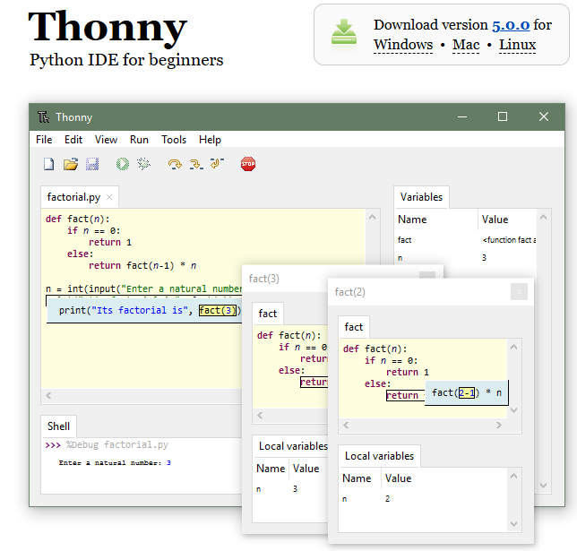

### 1.2 Conectar el ESP32

1. Conecta el ESP32 a la PC con un cable USB 

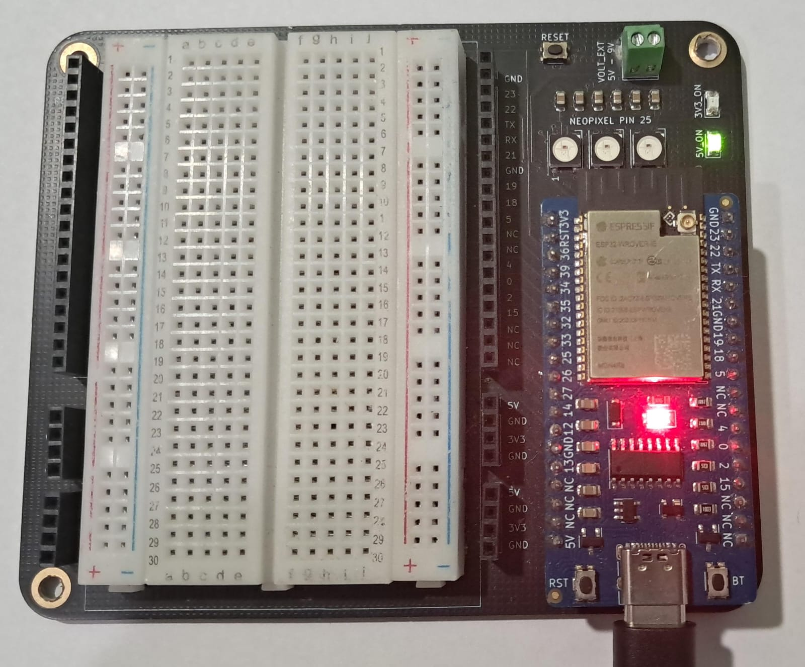

2. Abre Thonny con el comando siguiente
```bash
thonny
```
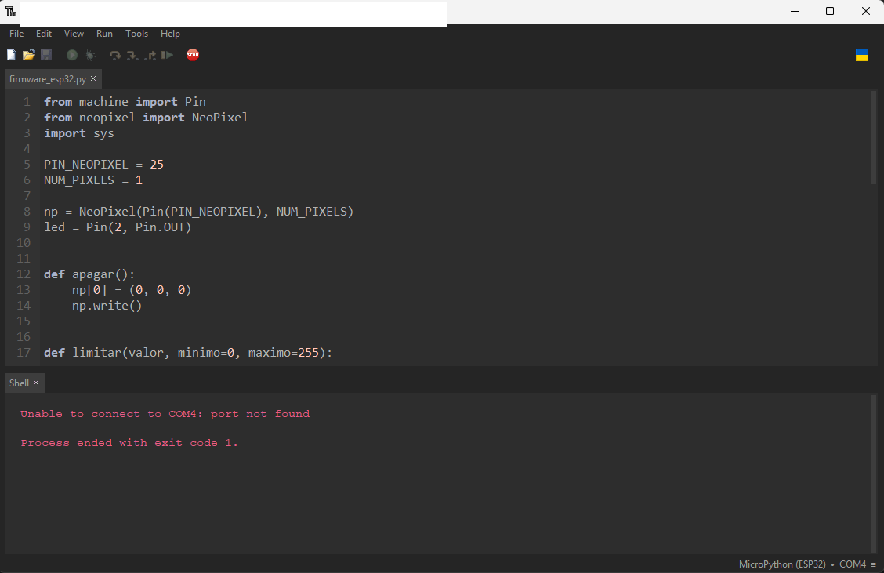


3. Ve a **Tools - Options - Interpreter**.
4. En "Intérprete" elige **MicroPython (ESP32)**.
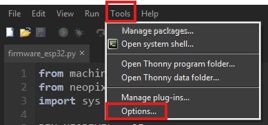
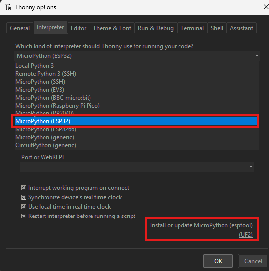

**Nota**
*Si es primera vez utilizando micropython debes instalarlo en la esp32* 

Selecciona la opcion en Interpreter de **Install or update MicroPython (esptool)**
Luego seleccionas el puerto serial donde este la ESP32, luego la familia de ESP32 (en este caso es la general para ESP32) y finalmente la variante, usaremos la variante generica de Espressif 
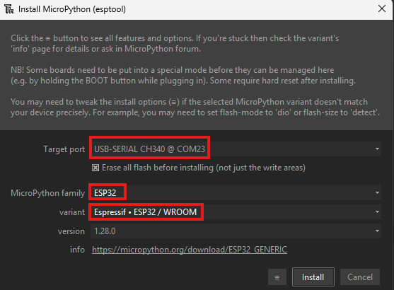

Luego presionamos instalar y esperamos a que termine el proceso (puede tardar unos segundos o minutos)
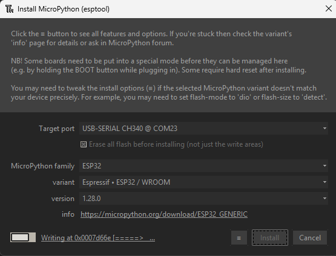
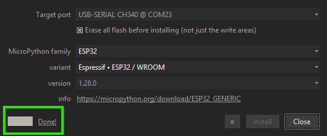

5. En "Puerto" elige el que corresponde a la ESP32 y presionamos OK
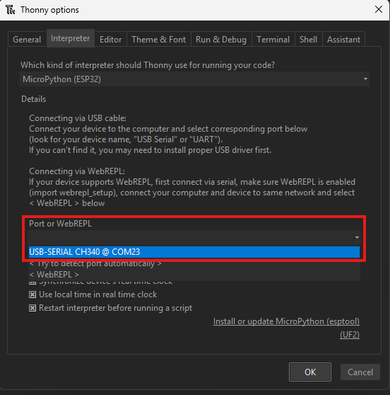


6. Abajo, en la consola (Shell), debería aparecer `>>>`. Eso significa que ya esta conectado con la ESP32.
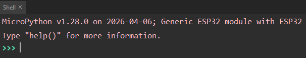


### 1.3 Cómo correr un script en el ESP32

1. Abre el archivo `.py` del laboratorio en Thonny (menú **Archivo → Abrir**).
2. Presiona el botón verde **Run (F5)**.
3. Los datos que el ESP32 imprime con `print(...)` (o los mensajes de confirmación, según el lab) aparecen en la **consola (Shell)** de abajo. 

*Ahí puedes confirmar que está funcionando bien antes de conectar Java.*
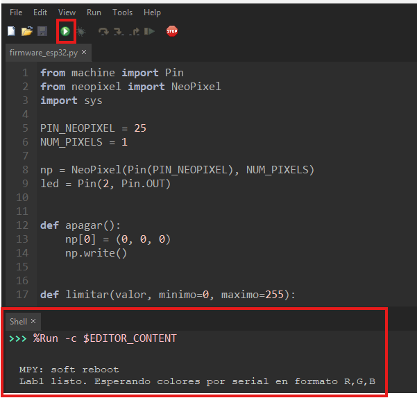

> **IMPORTANTE:** Java y Thonny **no pueden usar el puerto al mismo tiempo**.
> Cuando vayas a correr el programa de Java, primero detén el script en Thonny
> (botón rojo **Stop**) y cierra la conexión (o cierra Thonny). El ESP32 sigue
> ejecutando su último programa aunque cierres Thonny.

---

## Parte 2 — jSerialComm

Java por sí solo **no sabe leer un puerto USB/serie**, así que usamos una librería
llamada **jSerialComm**. 

Es **un solo archivo `.jar`**, no es
un plugin ni requiere instalación.

### 2.1 El `.jar` ya está en este repo

El archivo `jSerialComm-2.11.4.jar` ya está en esta carpeta.

> **Nota:** que el `.jar` esté ahí no basta. Java nunca busca `.jar`
> automáticamente en la carpeta, hay que decirle dónde está con `-cp`
> (*classpath*) cada vez que compilas o corres. 

> Sin `-cp` apuntando al jar,
> `javac` falla con `package com.fazecast.jSerialComm does not exist`
> aunque el archivo esté ahí al lado.

### 2.2 Primero: probar que todo quedó bien instalado (`SerialTest.java`)

Antes de meterte a cualquier lab, usa `SerialTest.java` para confirmar que el JDK y jSerialComm están funcionando:

```
javac -cp ".;jSerialComm-2.11.4.jar" SerialTest.java
java  -cp ".;jSerialComm-2.11.4.jar" SerialTest
```

Con el ESP32 conectado (y Thonny cerrado o detenido para no bloquear el
puerto), deberías ver algo como:

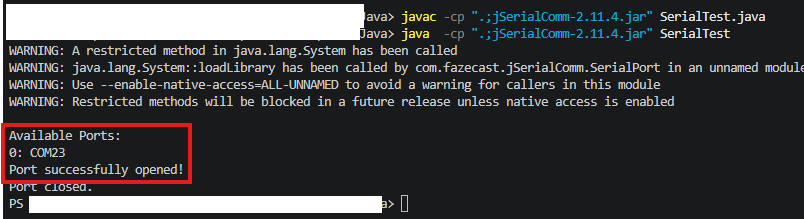

> **Warnings que puedes ignorar:** antes de esa salida es normal que
> aparezcan varias líneas como estas:
> ```
> WARNING: A restricted method in java.lang.System has been called
> WARNING: java.lang.System::loadLibrary has been called by com.fazecast.jSerialComm.SerialPort in an unnamed module (file:/.../jSerialComm-2.11.4.jar)
> WARNING: Use --enable-native-access=ALL-UNNAMED to avoid a warning for callers in this module
> WARNING: Restricted methods will be blocked in a future release unless native access is enabled
> ```
> Son advertencias del JDK 21+ porque jSerialComm usa una librería nativa
> (JNI) para hablar con el puerto serie, y las versiones nuevas de Java
> avisan cada vez que se hace eso. No son errores el programa sigue
> corriendo normal y el puerto se abre igual. Si molestan, se pueden quitar
> agregando `--enable-native-access=ALL-UNNAMED` al comando `java` (opcional,
> no es necesario para que funcione el lab).


### 2.3 Compilar y correr un laboratorio

Ya que `SerialTest.java` funcionó, el patrón es el mismo para cualquier
`LabN_*.java`. Estando en la carpeta del lab:

**Windows (usa `;` como separador):**
```
javac -cp ".;..\jSerialComm-2.11.4.jar" Lab1_solucion.java
java  -cp ".;..\jSerialComm-2.11.4.jar" Lab1_solucion
```

**Linux / macOS (usa `:` como separador):**
```
javac -cp ".:../jSerialComm-2.11.4.jar" Lab1_solucion.java
java  -cp ".:../jSerialComm-2.11.4.jar" Lab1_solucion
```

> Cambia `Lab1_solucion` por el archivo del laboratorio que estés corriendo.

---

## Parte 3 — Encontrar el nombre del puerto (COM)

Cada programa de Java tiene una línea como:

```java
String nombrePuerto = "COM3";   // <-- CAMBIA ESTO
```

Debes poner ahí el mismo puerto que Thonny (o `SerialTest.java`) mostró:

- **Windows:** `COM3`, `COM4`, `COM5`, etc. (mira en el Administrador de Dispositivos → Puertos).
- **Linux:** `/dev/ttyUSB0` o `/dev/ttyACM0`.
- **macOS:** `/dev/cu.usbserial-XXXX` o `/dev/cu.SLAB_USBtoUART`.

---

## Resumen del flujo de trabajo (cada vez que hagas un lab)

1. Abre el script `.py` del lab en Thonny y presiona **Run** para cargarlo al ESP32.
2. Verifica en la consola de Thonny que todo esté funcionando (imprime datos o mensajes de confirmación).
3. **Detén Thonny** (Stop) para liberar el puerto.
4. En la terminal, compila y corre el programa de Java con el `.jar` (Parte 3.2).
5. El programa de Java empieza a leer o enviar datos por el puerto serie.

---

